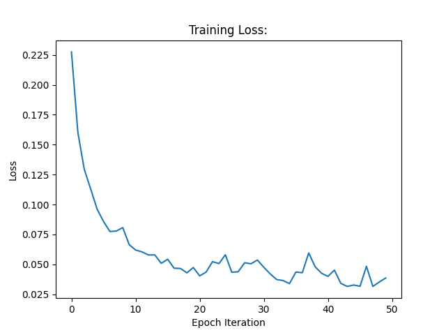
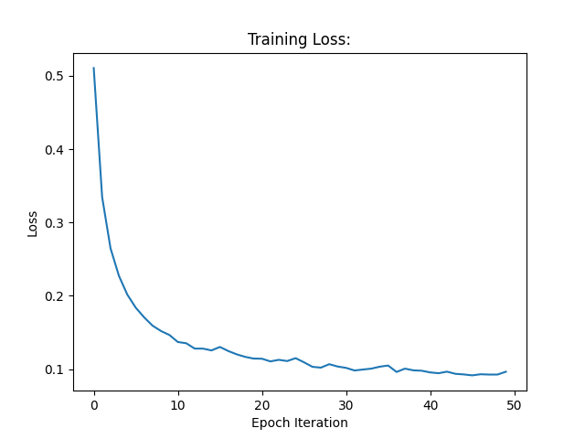
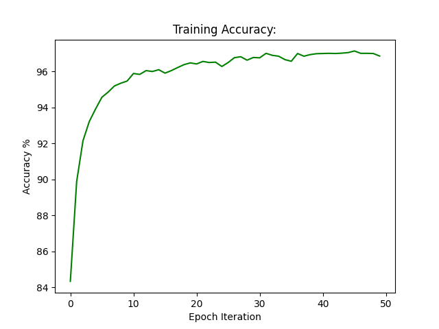

## Tensorflow MNIST Classification
This repository includes a Tensorflow 1.14.0 MLP applied to the standard MNIST dataset. There are two types of models that were implemented in this repository, a fully-connected model and a convolutional model followed by a fully-connected model. Given that the MNIST dataset is an image classification dataset, we expect the convolutional model to produce stronger results. Convolutional layers are able to recognize the spatial locality of image features. Also, these layers are able to take advantage of weight sharing through the use of lightweight kernel objects. 

## Fully-Connected Model
This model has 3 dense layers. The first two layers are followed by sigmoid activation functions. The final layer uses softmax activation. The cost function used for this network is cross-entropy loss. The code snippet, below, details the size of each of the dense layers:

```Python
# Fully-Connected Parameters:
input_nodes = np.shape(x_train)[1] # input_nodes = 28 * 28
increase_factor = 1.5
hidden_layer_1 = round(input_nodes * increase_factor) # hidden_layer_1 = 28 * 28 * 1.5
hidden_layer_2 = round(hidden_layer_1 * increase_factor) # hidden_layer_2 = 28 * 28 * 1.5^2
output_layer = 10
```

## Fully-Connected Results:
The training loss curve corresponding to the fully-connected model is shown in this Figure:



*Figure 1: Fully-connected training loss plot*

The training curve is relatively smooth and shows little stability. This confirms that the selected hyperparameters effectively mitigated instability. Figure 2 delineates the accuracy plot achieved during training:


*Figure 2: Fully-connected training accuracy plot*

The fully-connected model achieved a testing accuracy of 97.2%. 

## Convolutional Model
This model begins with two convolutional-pooling layers followed by three fully-connected layers. The Leaky-ReLU activation function is applied to the output of each convolutional layer and immediately followed by max-pooling. The parameters used for all 5 layers are illustrated by the code snippet, below:

```Python
 # Conv-Pooling Layer 1:
# Input: None x 28 x 28 x 1
layer_1_depth = 6
k1_width = 5
stride_1 = 1
padding_1 = "SAME"
# Conv-Pooling Layer 2:
# Input: None x 14 x 14 x 6
layer_2_depth = 18
k2_width = 7
stride_2 = 1
padding_2 = "SAME"
# Output: None x 7 x 7 x 18

# Fully Connected:
increase_factor = 1.5
# conv_output_nodes = 7 x 7 x 18
hidden_layer_3 = round(conv_output_nodes * increase_factor)
hidden_layer_4 = round(hidden_layer_3 * increase_factor)
output_layer = 10
```

Given the black and white nature of the images, there is only 1 input channel. Each convolutional-pooling layer increases the number of channels substantially. Furthermore, these layers thin the dimensionality of the feature maps as the data progresses through the network. The output from the convolutional segment of the network is passed in to the fully-connected segment. The dense layers contained in this segment are large and duplicate the structure of the dense layers in the previous section. The following code snippet illstrates the actual Tensorflow implementation of the aforementioned parameters:

```Python
# Layer 1:
k1 = tf.Variable(tf.random_normal([k1_width, k1_width, input_depth, layer_1_depth]))
y1 = tf.nn.leaky_relu(tf.nn.conv2d(x, k1, [stride_1], padding_1))
y1 = tf.nn.pool(y1, [2, 2], pooling_type="MAX", padding="SAME", strides=[2, 2])
# Layer 2:
k2 = tf.Variable(tf.random_normal([k2_width, k2_width, layer_1_depth, layer_2_depth]))
y2 = tf.nn.leaky_relu(tf.nn.conv2d(y1, k2, [stride_2], padding_2))
y2 = tf.nn.pool(y2, [2, 2], pooling_type="MAX", padding="SAME", strides=[2, 2])
y2 = tf.reshape(y2, [-1, conv_output_nodes])
# Layer 3:
W3 = tf.Variable(tf.truncated_normal([conv_output_nodes, hidden_layer_3], stddev=0.15))
b3 = tf.Variable(tf.zeros([hidden_layer_3]))
y3 = tf.math.sigmoid(tf.matmul(y2, W3) + b3)
# Layer 4:
W4 = tf.Variable(tf.truncated_normal([hidden_layer_3, hidden_layer_4], stddev=0.15))
b4 = tf.Variable(tf.zeros([hidden_layer_4]))
y4 = tf.math.sigmoid(tf.matmul(y3, W4) + b4)
# Layer 5:
W5 = tf.Variable(tf.truncated_normal([hidden_layer_4, output_layer], stddev=0.15))
b5 = tf.Variable(tf.zeros([output_layer]))
y = tf.matmul(y4, W5) + b5
```

Cross-entropy was used to measure the loss for the convolutional model. This loss function is a strong multi-class classification loss function. The following are the training parameters that were used:

```Python
# Training Parameters:
learning_rate = 0.0001
num_epochs = 50
batch_size = 512
```

### Convolutional Results:
The following Figure delineates the training loss curve for the model described in the previous section:



*Figure 3: Convolutional training loss plot*

The curve is smooth and has negligible instability. The following Figure illustrates the accuracy curve achieved during training:



*Figure 4: Convolutional training accuracy plot*

This curve, like the loss curve, follows the expected trajectory. This model was able to achieve a testing accuracy of _%. This is significantly higher than the testing accuracy of 97.2% achieved by the fully-connected model. 


Convolutional layer guide: https://stackoverflow.com/questions/34619177/what-does-tf-nn-conv2d-do-in-tensorflow
The dataset is publically avaialble here: http://yann.lecun.com/exdb/mnist/
